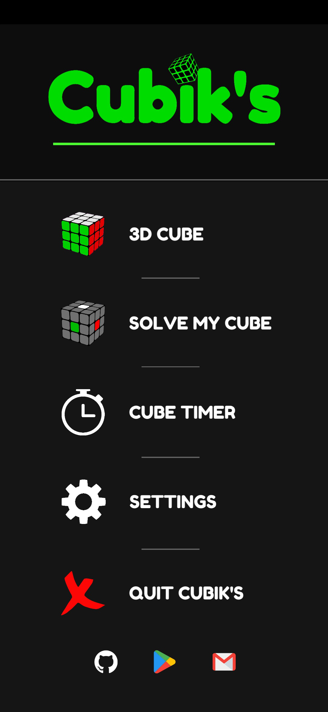

# Cubik's
### Cubik's is a 3 x 3 x 3 Rubik's cube simulator, solver and timer for android.   
User can play with 3D model of rubik's cube, solve their own cube by filling the colors and time their solves as well. The app can solve any scrambled cube within a second using two different solving methods, **CFOP(Fridrich)** and **Kociemba's two-phase method.** 
* CFOP method is used by most of the speedcuber. It's a layer by layer method having 4 main steps - Cross, F2L, OLL, PLL. Average length of this solution is 70 moves. 
* Two-phase method is developed by Herbert Kociemba. Average length of this solution is 21 moves. 
The app also guides the user to the solution step by step by performing every step is simulator. App has other useful settings as well.  
The app also has a timer which generates random scrambles and curresponding cube maps so user can time their solves as well.  
**Try it on google play:** https://play.google.com/store/apps/details?id=com.manojbhatt.cubiks    

                  

(Kociemba package belongs <a href = "https://github.com/Megalomatt/Kociemba/tree/Unity">here</a>. It's basically C# converted version of Kociemba's <a href = "http://kociemba.org/download.htm">Java package</a>.)
